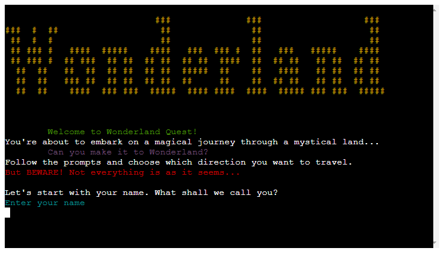
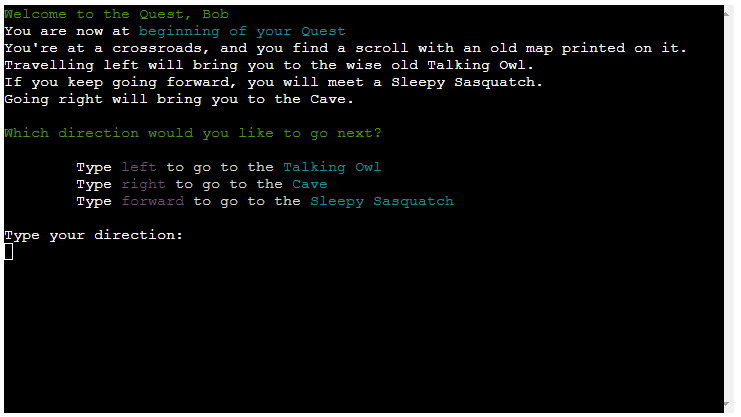
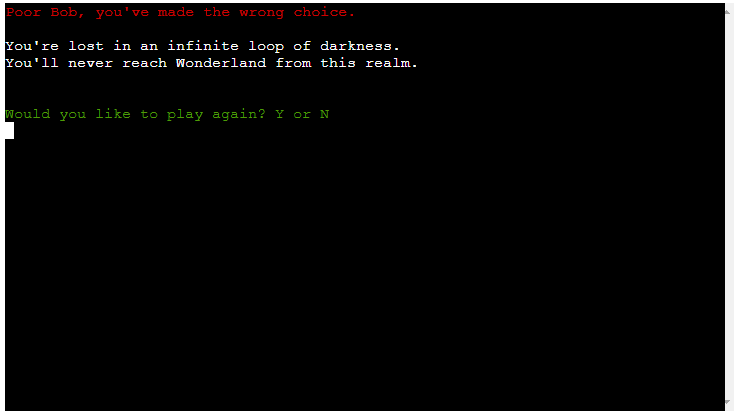
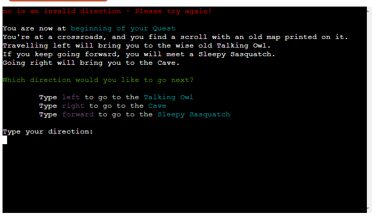
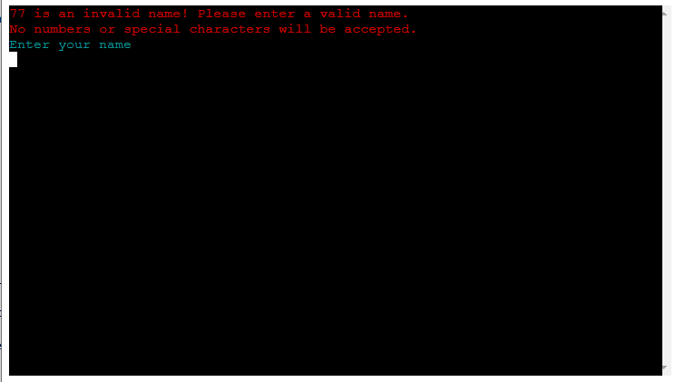
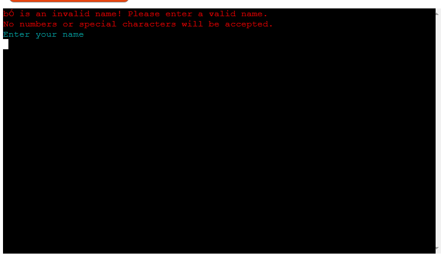
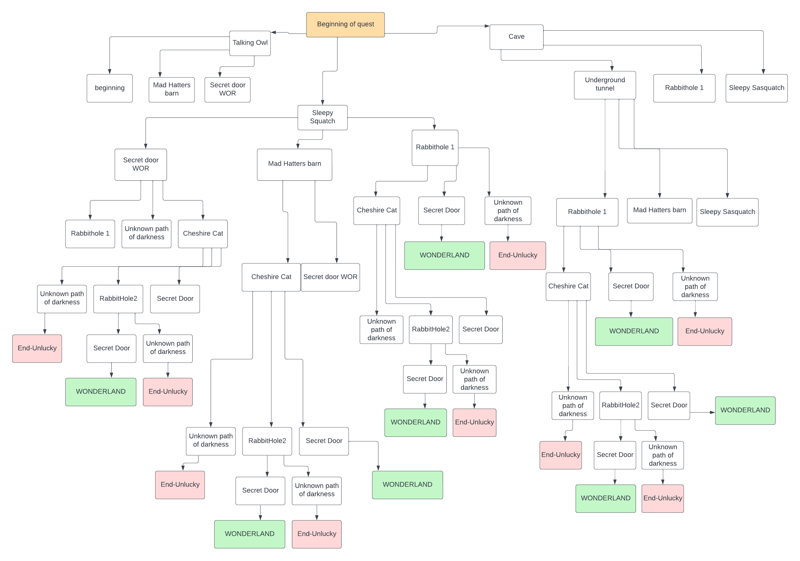

# Wonderland Quest

## About

**Wonderland Quest** is a text based adventure game based in a mythical place. 
The intention of the game is to make your way through the magical land, following prompts to find Wonderland.
**Venture foward if you dare.**

  
[**Live site**](https://wonderland.herokuapp.com)

# Table of contents
- [Features](#features)
    - [Existing Features](#existing-features)
    - [Future Features](#future-features)
- [Tools & Technologies](#tools--technologies-used)
- [Data Model](#data-model)
    - [Flowchart](#flowchart)
    - [Classes & Functions](#classes--functions)
    - [Imports](#imports)
- [Testing](#testing)
- [Deployment](#deployment)
    - [Heroku Deployment](#heroku-deployment)
    - [Local Deployment](#local-deployment)
    - [Cloning](#cloning)
    - [Forking](#forking)
- [Credits](#credits)
    - [Content](#content)
    - [Media](#media)
    - [Acknowledgements](#acknowledgements)

---

## Features

### Existing Features

- **Free user inputs to control directionality of play**

    - The user can freely type  their chosen direction in text format. (left, right, forward).

        

- **Places**

    - Each location has its own location ID, along with associated commands, stories and next location. 

        

- **Kill Sequence**  

    - Certain paths in the game will result in the user failing to complete the journey

      

- **Input validation**

| Screenshot | Notes |
| --- | --- |
|  | Only accepted directions are those listed within the Places dictionary. Anything else will be invalid.  |
|  | Name input will not allow any numerical characters. |
|  | Name input will not allow any special characters. |

### Future Features

- Extended routes
    - Allow for a greater scope of story by building out the places dictionary to include more stops & locations
- Inventory system
    - Introduce inventory items that the player can collect to aide their Quest.
- Add problem-solving to journey
    - Ask players to solve riddles/clues that will help them move to special places in the journey.
- Expand on character variables
    - Build further functions to include character health, weather, inventory feedback etc

---
## Tools & Technologies Used

- [Python](https://www.python.org) used as the back-end programming language.
- [Git](https://git-scm.com) used for version control. (`git add`, `git commit`, `git push`)
- [GitHub](https://github.com) used for secure online code storage.
- [Gitpod](https://gitpod.io) used as a cloud-based IDE for development.
- [Markdown Builder by Tim Nelson](https://traveltimn.github.io/markdown-builder) used to help generate the Markdown files.
- [Heroku](https://www.heroku.com) used for hosting the deployed back-end site.

## Data Model

### Flowchart

To follow best practice, a flowchart was created for the app's logic,
and mapped out before coding began using a free version of
[Lucidchart](https://www.lucidchart.com/pages/ER-diagram-symbols-and-meaning)

### Game Functions

The primary functions used on this application are:

- `clear()`
    - Clears console.
- `greeting()`
    - Displays greeting message
- `arrive_at_place()`
    - Loops through current location and asks for user in put for next directions.
- `validate_name()`
    - Verifies that only acceptable characters have been submitted. 

### Imports

I've used the following Python packages and/or external imported packages.

- `os`: used for adding a `clear()` function.
- `colorama`: used for including color in the terminal.
- `pyfiglet`: used for Wonderland ascii art on main game page.

## Testing

For all testing, please refer to the [TESTING.md](TESTING.md) file.

## Deployment

Code Institute has provided a [template](https://github.com/Code-Institute-Org/python-essentials-template) to display the terminal view of this backend application in a modern web browser.
This is to improve the accessibility of the project to others.

The live deployed application can be found deployed on [Heroku](https://wonderland.herokuapp.com/).

### Heroku Deployment

This project uses [Heroku](https://www.heroku.com), a platform as a service (PaaS) that enables developers to build, run, and operate applications entirely in the cloud.

Deployment steps are as follows, after account setup:

- Select **New** in the top-right corner of your Heroku Dashboard, and select **Create new app** from the dropdown menu.
- Your app name must be unique, and then choose a region closest to you (EU or USA), and finally, select **Create App**.
- From the new app **Settings**, click **Reveal Config Vars**, and set the value of KEY to `PORT`, and the value to `8000` then select *add*.
- If using any confidential credentials, such as CREDS.JSON, then these should be pasted in the Config Variables as well.
- Further down, to support dependencies, select **Add Buildpack**.
- The order of the buildpacks is important, select `Python` first, then `Node.js` second. (if they are not in this order, you can drag them to rearrange them)

Heroku needs two additional files in order to deploy properly.
- requirements.txt
- Procfile

You can install this project's **requirements** (where applicable) using:
- `pip3 install -r requirements.txt`

If you have your own packages that have been installed, then the requirements file needs updated using:
- `pip3 freeze --local > requirements.txt`

The **Procfile** can be created with the following command:
- `echo web: node index.js > Procfile`

For Heroku deployment, follow these steps to connect your own GitHub repository to the newly created app:

Either:
- Select **Automatic Deployment** from the Heroku app.

Or:
- In the Terminal/CLI, connect to Heroku using this command: `heroku login -i`
- Set the remote for Heroku: `heroku git:remote -a app_name` (replace *app_name* with your app name)
- After performing the standard Git `add`, `commit`, and `push` to GitHub, you can now type:
	- `git push heroku main`

The frontend terminal should now be connected and deployed to Heroku!

### Local Deployment

This project can be cloned or forked in order to make a local copy on your own system.

For either method, you will need to install any applicable packages found within the *requirements.txt* file.
- `pip3 install -r requirements.txt`.

If using any confidential credentials, such as `CREDS.json` or `env.py` data, these will need to be manually added to your own newly created project as well.

#### Cloning

You can clone the repository by following these steps:

1. Go to the [GitHub repository](https://github.com/Dmp-86/wonderland) 
2. Locate the Code button above the list of files and click it 
3. Select if you prefer to clone using HTTPS, SSH, or GitHub CLI and click the copy button to copy the URL to your clipboard
4. Open Git Bash or Terminal
5. Change the current working directory to the one where you want the cloned directory
6. In your IDE Terminal, type the following command to clone my repository:
	- `git clone https://github.com/Dmp-86/wonderland.git`
7. Press Enter to create your local clone.

Alternatively, if using Gitpod, you can click below to create your own workspace using this repository.

Please note that in order to directly open the project in Gitpod, you need to have the browser extension installed.
A tutorial on how to do that can be found [here](https://www.gitpod.io/docs/configure/user-settings/browser-extension).

#### Forking

By forking the GitHub Repository, we make a copy of the original repository on our GitHub account to view and/or make changes without affecting the original owner's repository.
You can fork this repository by using the following steps:

1. Log in to GitHub and locate the [GitHub Repository](https://github.com/Dmp-86/wonderland)
2. At the top of the Repository (not top of page) just above the "Settings" Button on the menu, locate the "Fork" Button.
3. Once clicked, you should now have a copy of the original repository in your own GitHub account!

### Local VS Deployment

At the time of writing, there will be no difference between the local and the deployed version on Heroku.

---

## Credits

### Content

| Source | Location | Notes |
| --- | --- | --- |
| [Markdown Builder by Tim Nelson](https://traveltimn.github.io/markdown-builder) | README and TESTING | tool to help generate the Markdown files |
| [PyPi](https://pypi.org/project/colorama/) | Colorama tutorial | How to apply Colorama |
| [W3 Schools](https://www.w3schools.com/python/python_lambda.asp) | Lambda Tutorial | For Lambda function |
| [YouTube](https://www.youtube.com/watch?v=u51Zjlnui4Y) | PP3 terminal | tutorial for adding color to the Python terminal |

### Media

No external media sources used.

### Acknowledgements

Use this space to provide attribution to any supports that helped, encouraged, or supported you throughout the development stages of this project.
A few examples have been provided below to give you some ideas.

- I would like to thank my Code Institute mentor, [Tim Nelson](https://github.com/TravelTimN) For his support through this project.
- I would like to thank the [Code Institute](https://codeinstitute.net) tutor team for their assistance with troubleshooting and debugging some project issues.
- I would like to thank the [Code Institute Slack community](https://code-institute-room.slack.com) for the moral support; it kept me going during periods of self doubt and imposter syndrome.

---
