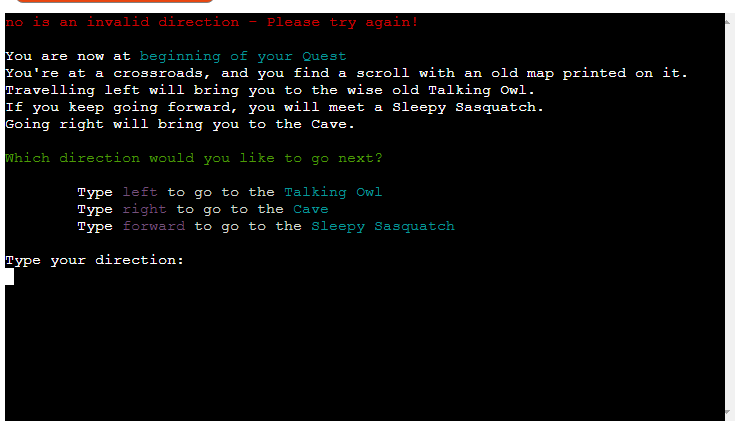
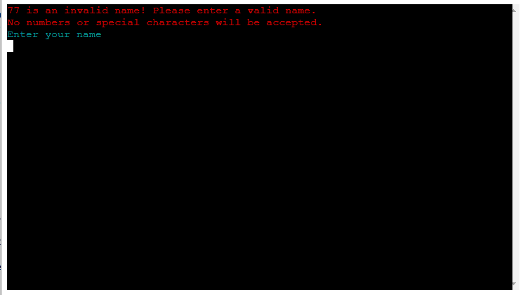
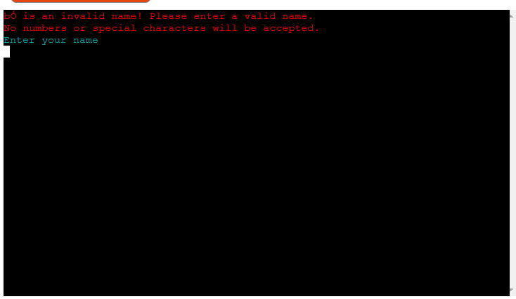
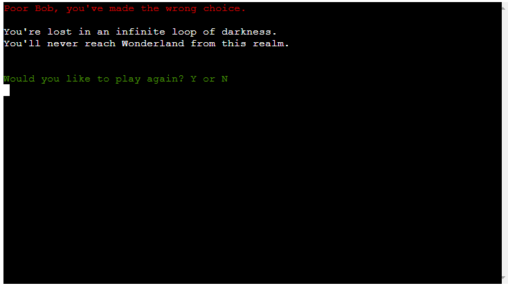

# Testing

Return back to the [README.md](README.md) file.

## Code Validation
### Python

I have used the recommended [CI Python Linter](https://pep8ci.herokuapp.com) to validate all of my Python files.

| File | CI URL | Screenshot | Notes |
| --- | --- | --- | --- |
| run.py | [CI PEP8](https://pep8ci.herokuapp.com/) |  | One line length error, given that this is a complex lambda function it has been marked NOQA. |
| rooms.py | [CI PEP8](https://pep8ci.herokuapp.com/) |  | Some errors found with line length, however there is no effect on gameplay. |

## Lighthouse Audit

I've tested my deployed project using the Lighthouse Audit tool to check for any major issues.

| Page | Size | Screenshot | Notes |
| --- | --- | --- | --- |
| Home | Desktop |  | No warnings |
| Home | Mobile |  | Minor performance warning |

## Defensive Programming

- Users must enter a valid letter/word/string when prompted otherwise one of the things underneath will happen.

| Screenshot | Notes |
| --- | --- |
|  | You cannot enter anything other than directions (dependent on location, directions will change). |
|  | You cannot insert numbers in the name field.|
|  | You cannot include special characters in the name field.|
|  | Players cannot continue at this point|

- The application has been tested numerous times to ensure that the user cannot break it by inputting the wrong commands.

## Bugs

No known bugs

---